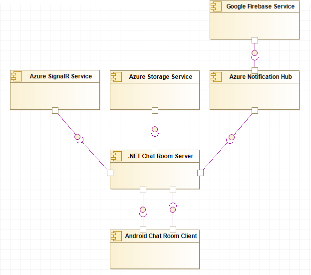
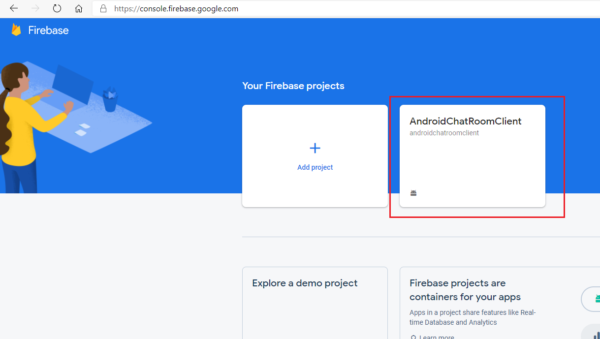
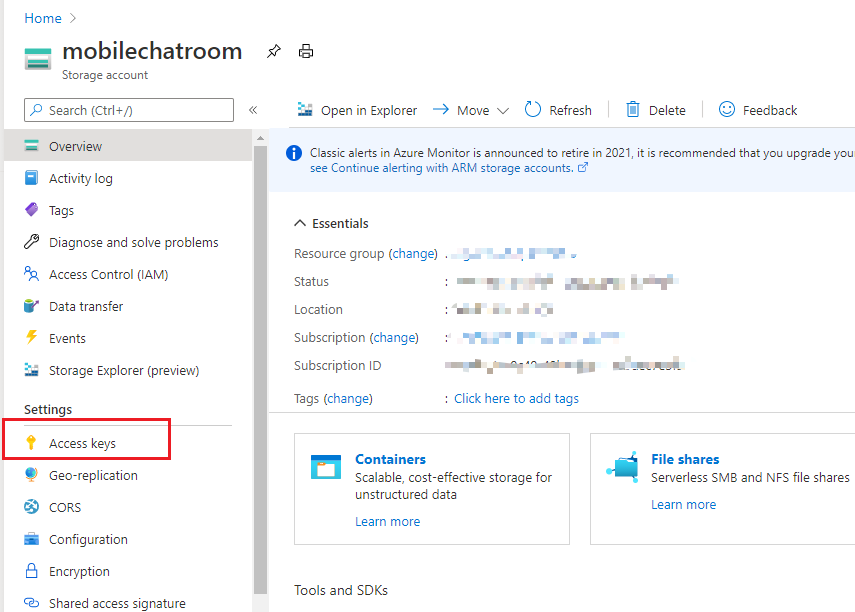
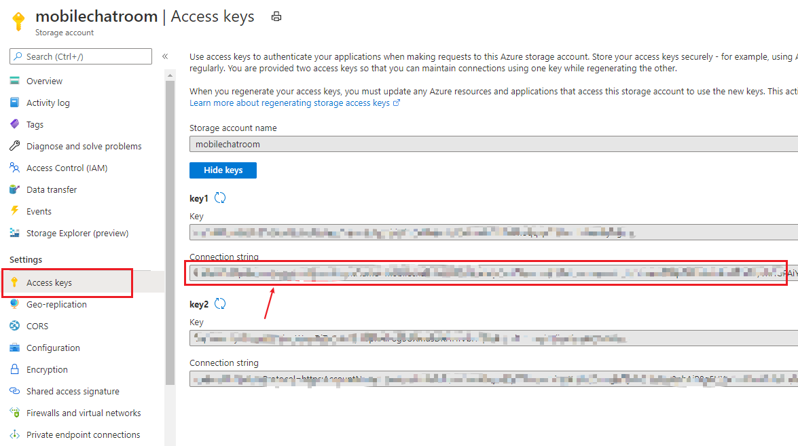
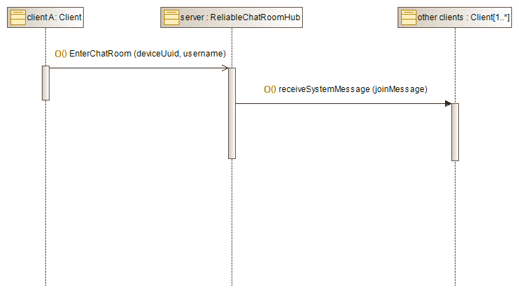
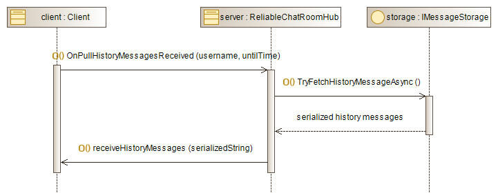
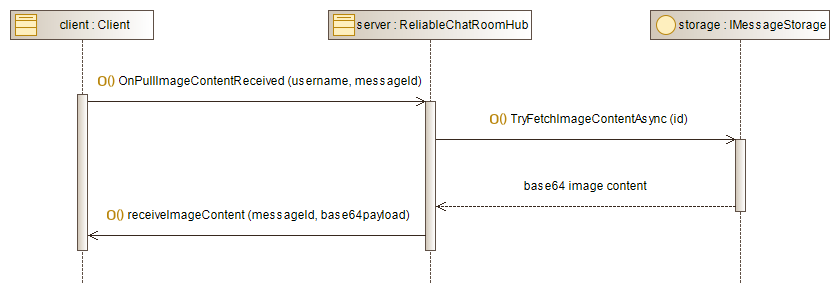

# Build A SignalR-based Reliable Mobile Chat Room Server

This tutorial shows you how to build a reliable mobile chat room server with SignalR. You'll learn how to:

> **&#x2713;** Build a simple reliable chat room with Azure SignalR.
>
> **&#x2713;** Integrate chat room server with Firebase Notification.
> 
> **&#x2713;** Use Azure Storage table and blob services.

## Prerequisites
* Install [.NET Core 3.1 SDK](https://dotnet.microsoft.com/download/dotnet-core/3.1)
* Install [Visual Studio 2019](https://visualstudio.microsoft.com/vs/) (Version >= 16.3)
* Create an [Azure SignalR Service](https://azure.microsoft.com/en-us/services/signalr-service/)
* Create an [Azure Storage Account](https://docs.microsoft.com/en-us/azure/storage/common/storage-account-overview)
* Create an [Azure Notification Hub](https://azure.microsoft.com/en-us/services/notification-hubs/)
* Create a [Google Firebase Service](https://firebase.google.com/)

## Abstract

There are four main conponents in a reliable chat room server-side system: 
1. Local .NET chat room server
2. Azure SignalR Service as message delievery service
3. Azure Storage as message storage service
4. Azure Notification Hub (and Google Firebase behind it) as notification service



This repo will focus on **.NET Chat Room Server** and its interaction with those components mentioned above.


## Create and Setup Your Google Firebase Service For Notificaiton

See Google [reference](https://firebase.google.com/docs/cloud-messaging/android/client) of *Set up a Firebase Cloud Messaging client app on Android*.

Get the server key we need to build the chat room server:

1. Goto [Firebase Console](https://console.firebase.google.com/) and select your client app name



2. *Goto Settings -> Project Settings -> Cloud Messaging Tab* and then copy your server key

If there is no server key here, add one. 

You will need to use the server key in Azure Notification Hub Service.

## Create and Setup Your Azure Notification Hub Service

See [reference](https://docs.microsoft.com/en-us/azure/notification-hubs/notification-hubs-android-push-notification-google-fcm-get-started) of *Tutorial: Send push notifications to Android devices using Firebase SDK version 0.6*

One core thing to do is adding your Firebase Server Key into your Notification Hub:

1. Enter your Notification Hub in [Azure Portal](https://ms.portal.azure.com/) and click *Google (GCM/FCM)*


2. Paste your server key in the server input


## Create Your Azure Storage Account

See [reference](https://docs.microsoft.com/en-us/azure/storage/common/storage-account-create?tabs=azure-portal) of *Create a storage account*.

We will need connection string for chat room server:

1. Enter your Storage Account in [Azure Portal](https://ms.portal.azure.com/) and click *Access Keys*



2. Copy your Storage Account connection string



## Create Your Azure SignalR service

See [reference](https://docs.microsoft.com/en-us/azure/azure-signalr/signalr-quickstart-dotnet-core#:~:text=To%20create%20an%20Azure%20SignalR,the%20results%2C%20and%20select%20Create.) about *Quickstart: Create a chat room by using SignalR Service*.

We will need connection string for chat room server:

1. Enter your SignalR Service in [Azure Portal](https://ms.portal.azure.com/) and click *Keys*


2. Copy your SignalR Service connection string


## Congifure Your Reliable Chat Room Server

Clone/download the source code from repo. 

See [reference](https://docs.microsoft.com/en-us/aspnet/core/security/app-secrets?view=aspnetcore-3.1&tabs=windows) about *Safe storage of app secrets in development in .NET Core*.

1. Change your directory to the project directory

Run cmd
```dotnetcli
dotnet user-secrets init
```

2. Add user secrets

Run cmd
```dotnetcli
dotnet user-secrets set "Azure:SignalR:ConnectionString" $YOUR_SIGNALR_CONNECTION_STRING
dotnet user-secrets set "Azure:Storage:ConnectionString" $YOUR_STORAGE_ACCOUNT_CONNECTION_STRING
dotnet user-secrets set "Azure:NotificationHub:HubName" $YOUR_HUB_NAME
dotnet user-secrets set "Azure:NotificationHub:ConnectionString" $YOUR_NOTIFICATION_HUB_CONNECTION_STRING
```

## Run Your Reliable Chat Room Server
Change your directory to the project directory.

Run cmd
```dotnet cli
dotnet run
```

If succeed, the output will be like:
```dotnet cli
Hosting environment: Development
Content root path: *\source\repos\AzureSignalR-samples\samples\ReliableChatRoom\ReliableChatRoom
Now listening on: http://localhost:5000
Now listening on: https://localhost:5001
Application started. Press Ctrl+C to shut down.
```

## How Does Reliable Chat Protocol Work?

1. Client enters the chat room


2. Client broadcasts a message to all other clients


3. Client sends a private message to another client


4. Client pulls history messages from serverr


5. Client pull image content from server


6. Client leaves the chat room
